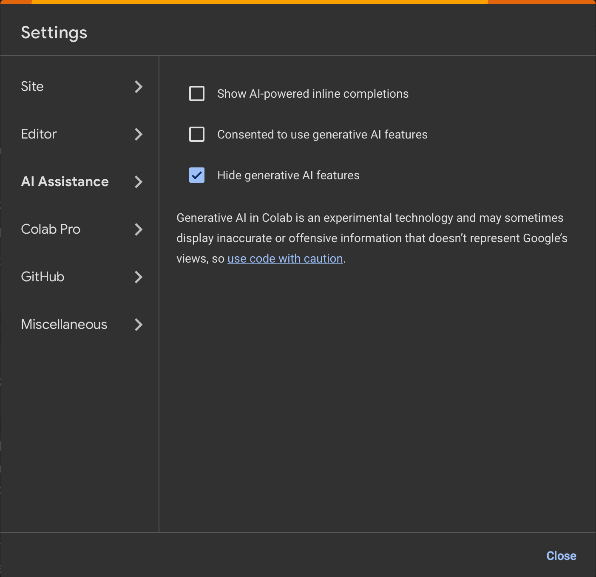

These are the official lab instructions for the k-space lab for the Stockholm University course Magnetic Resonance Imaging (FK8032). 

If you don't have Python set up on your computer, you can access the lab directly with Google Colab or Binder by clicking the links below

[](https://colab.research.google.com/github/fyrdahl/kspace-lab/blob/master/kspacelab.ipynb)
[](https://mybinder.org/v2/gh/fyrdahl/kspace-lab/HEAD?urlpath=%2Fdoc%2Ftree%2Fkspacelab.ipynb)

You can also run the lab as a Docker container, see separate instructions below.

Use the following link if you only want to render the instructions without launching a Jupyter Notebook:

[](https://nbviewer.jupyter.org/github/fyrdahl/kspace-lab/blob/master/kspacelab.ipynb)

Required packages:
* numpy
* scipy
* matplotlib
* h5py


# Docker
If you have Docker installed on your computer, you can pull an environment for running the lab, including dependencies and data, from Dockerhub.

Run the following command in a terminal
```
docker run --rm -ti -p 8888:8888 fyrdahl/kspace-lab
```

Find your access token in the terminal output and paste it into a web browser, e.g.
```
 To access the server, open this file in a browser:
        file:///home/jovyan/.local/share/jupyter/runtime/jpserver-7-open.html
    Or copy and paste one of these URLs:
        http://localhost:8888/lab?token=a81d9e730c578acf913b59f062cad4775f7f0ac589a11485
        http://127.0.0.1:8888/lab?token=a81d9e730c578acf913b59f062cad4775f7f0ac589a11485
```


# Note on use of Generative AI
This exercise and the subsequent report is part of the examination of the course FK8032.
It is not allowed to use generative AI to solve the problems, or to write the subsequent lab report.

If you choose to work in Google Colab, you can turn off generative AI features by clicking Tools -> Settings -> AI Assistance



